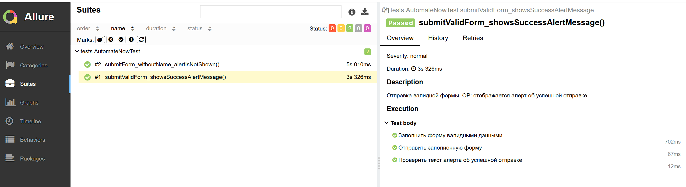
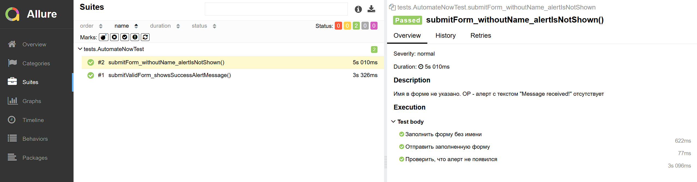

# UI Automation Tests Project

## Содержание
1. [О проекте](#о-проекте)
2. [Описание тестов](#описание-тестов)
3. [Запуск](#запуск)

## О проекте
Проект содержит UI-автотесты для тестирования формы https://practice-automation.com/form-fields/

Проект реализован с использованием следующих инструментов:
* Java 17
* Selenium WebDriver
* Chrome Browser
* JUnit 5
* Maven
* Allure Report
  
В проекте применены паттерны проектирования:
* Page Object Model
* Page Factory
* Fluent Interface

## Описание тестов

### Позитивный тест-кейс

Отправка валидной формы. ОР: отображается алерт об успешной отправке

Предусловие: 
открыта страница:
https://practice-automation.com/form-fields/

| Шаги                                                             | Тестовые данные                                                                                                                                            | Результат                                      |
|------------------------------------------------------------------|------------------------------------------------------------------------------------------------------------------------------------------------------------|------------------------------------------------|
| Ввести имя                                                       | Test                                                                                                                                                       |                                                |
| Ввести пароль                                                    | qwerty                                                                                                                                                     |                                                |
| Выбрать любимые напитки                                          | Milk и Coffee                                                                                                                                              |                                                |
| Выбрать любимый цвет                                             | Yellow                                                                                                                                                     |                                                |
| Выбрать значение Automation                                      | YES                                                                                                                                                        |                                                |
| Ввести email                                                     | test@example.com                                                                                                                                           |                                                |
| Заполнить поле Message информацией об инструментах автоматизации | Количество инструментов: {описанные в пункте Automation tools"}. Самый длинный инструмент по количеству символов: {вычисленный из списка Automation tools} |                                                |
| Нажать кнопку Submit                                             |                                                                                                                                                            | Появляется alert с текстом "Message received!" |

### Негативный тест-кейс

Имя в форме не указано. ОР - алерт с текстом "Message received!" отсутствует

Предусловие:
открыта страница:
https://practice-automation.com/form-fields/

| Шаги                                                             | Тестовые данные                                                                                                                                            | Результат                                         |
|------------------------------------------------------------------|------------------------------------------------------------------------------------------------------------------------------------------------------------|---------------------------------------------------|
| Ввести пароль                                                    | qwerty                                                                                                                                                     |                                                   |
| Выбрать любимые напитки                                          | Milk и Coffee                                                                                                                                              |                                                   |
| Выбрать любимый цвет                                             | Yellow                                                                                                                                                     |                                                   |
| Выбрать значение Automation                                      | YES                                                                                                                                                        |                                                   |
| Ввести email                                                     | test@example.com                                                                                                                                           |                                                   |
| Заполнить поле Message информацией об инструментах автоматизации | Количество инструментов: {описанные в пункте Automation tools"}. Самый длинный инструмент по количеству символов: {вычисленный из списка Automation tools} |                                                   |
| Нажать кнопку Submit                                             |                                                                                                                                                            | Alert с текстом "Message received!" не появляется |

## Запуск

`mvn clean test` - запуск тестов через Maven;

`allure serve` - формирование отчёта Allure после выполнения тестов.

*Сформированный отчет Allure по позитивному сценарию*

*Сформированный отчет Allure по негативному сценарию*

